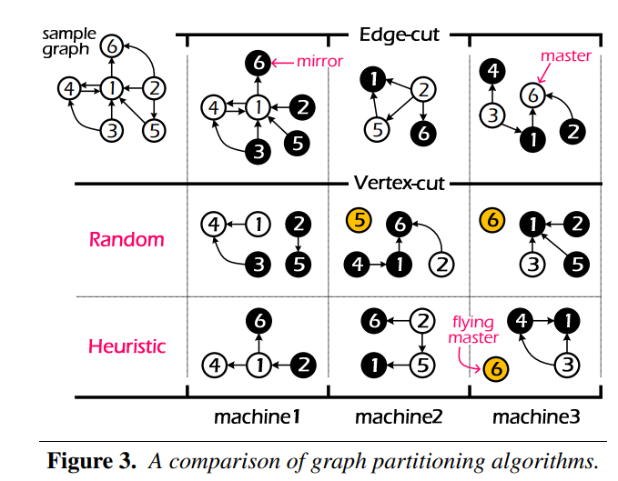

# Homework 8: Graph Partitioning

Introduction to Big Data Systems course

**Due:  November 17, 2024** 23:59 China time. Late submission results in lower (or even no) scores.

For questions or concerns, contact TA (Yanzheng Cai) by WeChat. Or send an email to cyz22@mails.tsinghua.edu.cn if you could not use WeChat. 

## Overview

Graph partitioning plays a vital role in reducing communication and ensuring load balance. In this assignment, you will implement two traditional strategies of graph partitioning in graph processing systems, edge-cut and vertex-cut.


## Background

#### Balanced P-way Edge-Cut

This approach of Pregel and GraphLab 1 to place a graph on a cluster of p machines is to construct a balanced p-way edge-cut in which vertices are evenly assigned to machines and the number of edges spanning machines is minimized.

Under edge-cut in the figure below, six vertices are randomly (i.e., hash modulo #machine) assigned to three machines. And edge-cut creates replicated vertices (e.g., mirrors) and edges to form a locally consistent graph state in each machine.


#### Balanced P-way Vertex-Cut

This approach of PowerGraph (or called GraphLab 2) is to construct a balanced p-way vertex-cut in which edges are evenly assigned to machines and the number of vertices spanning machines is minimized.

As described in PowerGraph’s Paper҅ there are two approaches to place graph: Random Edge Placement && Greedy Heuristic Edge Placement (i.e., Coordinated). Under vertex-cut in the figure below, six vertices are assigned to three machines randomly (i.e., hash modulo #machine) or in greedy heuristic approach. And vertex-cut will creates some replicated vertices (e.g., mirrors). For each vertex v with multiple replicas, one of the replicas is randomly (i.e., hash modulo #machine) nominated as the master which maintains the master version of the vertex data. All remaining replicas of v are then mirrors and maintain a local cached read only copy of the vertex data.



#### Balanced P-way Hybrid-Cut

This approach is a new hybrid vertex-cut algorithm used in PowerLyra that uses differentiated partitioning for low-degree and high-degree vertices. 

You can find the detailed description of this approach in the Chapter 4.1 of the PowerLyra’s Paper. 


## What you need to do?

Given a graph data in binary form and the number of partitions N, your program should partition the input graph into N parts and output some basic information of these partitions (will be described in detail).


#### Part 1 (80 points)

You should at least implement 2 approaches: balanced p-way edge-cut and balanced p-way vertex-cut (randomly) and test your program on different datasets and different numbers of partitions (2,3,4,8). 

Also, you need to provide the visualization (like the figure ablove) of the result of partition algorithm you implemented on a very small dataset called small-5.graph (number of partitions is 3) in your report. 

You also need to analyze and compare different approaches of partitioning on different types of graph data. 

The score of twitter graph (11G) accounts for 20 points.


#### Part 2 (20 points)

If you want the remaining 20 points, you need to implement the greedy heuristic approach of vertex-cut (10pts) and the Balanced p-way Hybrid-Cut described in PowerLyra (10 pts). 

- Hint 1: PowerGraph mandates the creation of a flying master of vertex (e.g., vertex 5 and 6 in the figure above) in its hash-based location to support simple external querying for some algorithms even without edges. In this assignment, it is optional. 
- Hint 2: In the approach of hybrid-cut, you need define the threshold (θ) to identify high-degree vertices by yourself. You can read the paper for more details.


## Input Format

Edge list of unweighted graphs in binary form. If the graph is undirected, each unordered pair of nodes appear only once. 

If you have problem about how to read binary graph data, you can refer to the simple C++ program provided.

Edges are tuples of <4 bytes source, 4 bytes destination>. 


## Output Format 

You need save the basic information of partitions in the text file. 

#### Edge-cut

```
Partition 0
<number of master vertices>
<number of total vertices (include master and mirror vertices) >
<number of replicated edges in this partition>
<number of edges in this partition (include replicated edges)>
Partition 1
... Same format as Partition 0
```

#### Vertex-cut

```
Partition 0
<number of master vertices>
<number of total vertices (include master and mirror vertices) >
<number of edges in this partition>
Partition 1
... Same format as Partition 0
```


## Sample 

#### Input 

The binary graph data of the sample graph in the figure above.

The number of partitions: 3.

#### Output (you need submit) 

**The result may be different due to your implementation.**

**Randomly edge-cut results**

```
Partition 0
2
6
5
7
Partition 1
2
4
3
4
Partition 2
2
5
4
4
```

**Randomly vertex-cut results** 

```
Partition 0
3
5
3
Partition 1
2
4
3
Partition 2
1
4
3
```


## Dataset

You need to test your program on 3 datasets in binary form and submit relevant output files. 

- `roadNet-PA.graph`, directed, 1088092 vertices, 3083796 edges, 24 MB 
- `synthesized-1b.graph`, undirected, 1000000 vertices, 4780364 edges, 36 MB 
- `twitter-2010.graph`, directed, 41652230 vertices, 1468365182 edges, 11 GB 

You also need to visualize the result of partitioning the small graph below into 3 partitions. 

- `small-5.graph`, undirected, 5 vertices, 5 edges, 40 B


## Environment

You may use any programming language. You may run the program anywhere (e.g., the server or your PC). 

If you use the server, the input data is located at `/data/hw8_data`. Please do not directly copy these graphs (especially the largest one) to your working directory on the server. You can use the following command instead.
`ln -s /data/hw8_data/twitter-2010.graph [destination]
`


## Hand-in 

Please submit your assignment containing your report, code and the results file (described in the Section of [Output Format](#output-format)).

Please describe your implementation in detail in your report. Besides, please tell us how to run your program successfully


## References

> 1. Malewicz, Grzegorz, et al. “Pregel: a system for large-scale graph processing.” Proceedings of the 2010 ACM SIGMOD International Conference on Management of data. ACM, 2010
> 2. Low, Yucheng, et al. “Distributed GraphLab: a framework for machine learning and data mining in the cloud.” Proceedings of the VLDB Endowment 5.8 (2012): 716- 727.
> 3. Gonzalez, Joseph E., et al. “Powergraph: Distributed graph-parallel computation on natural graphs.” Presented as part of the 10th USENIX Symposium on Operating Systems Design and Implementation (OSDI 12). 2012.
> 4. Chen, Rong, et al. “PowerLyra: differentiated graph computation and partitioning on skewed graphs.” Proceedings of the Tenth European Conference on Computer Systems. 2015.
