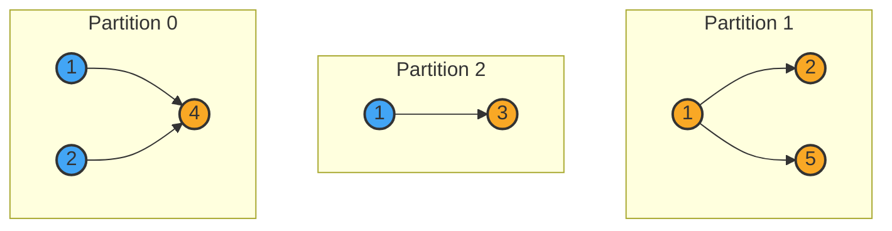

```mermaid
graph TD
subgraph Partition 1
1_1(("1")):::master
1_2(("2")):::master
1_5(("5")):::master
1_1 --> 1_2
1_1 --> 1_5
classDef master fill:#f9a825,stroke:#333,stroke-width:2px;
classDef normal fill:#42a5f5,stroke:#333,stroke-width:2px;
end
subgraph Partition 2
2_3(("3")):::master
2_1(("1")):::normal
2_1 --> 2_3
classDef master fill:#f9a825,stroke:#333,stroke-width:2px;
classDef normal fill:#42a5f5,stroke:#333,stroke-width:2px;
end
subgraph Partition 0
0_4(("4")):::master
0_1(("1")):::normal
0_2(("2")):::normal
0_1 --> 0_4
0_2 --> 0_4
classDef master fill:#f9a825,stroke:#333,stroke-width:2px;
classDef normal fill:#42a5f5,stroke:#333,stroke-width:2px;
end
```