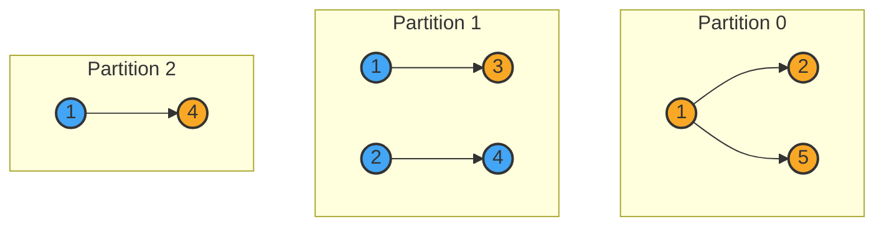

```mermaid
graph TD
subgraph Partition 0
0_1(("1")):::master
0_2(("2")):::master
0_5(("5")):::master
0_1 --> 0_2
0_1 --> 0_5
classDef master fill:#f9a825,stroke:#333,stroke-width:2px;
classDef normal fill:#42a5f5,stroke:#333,stroke-width:2px;
end
subgraph Partition 1
1_3(("3")):::master
1_1(("1")):::normal
1_2(("2")):::normal
1_4(("4")):::normal
1_1 --> 1_3
1_2 --> 1_4
classDef master fill:#f9a825,stroke:#333,stroke-width:2px;
classDef normal fill:#42a5f5,stroke:#333,stroke-width:2px;
end
subgraph Partition 2
2_4(("4")):::master
2_1(("1")):::normal
2_1 --> 2_4
classDef master fill:#f9a825,stroke:#333,stroke-width:2px;
classDef normal fill:#42a5f5,stroke:#333,stroke-width:2px;
end
```