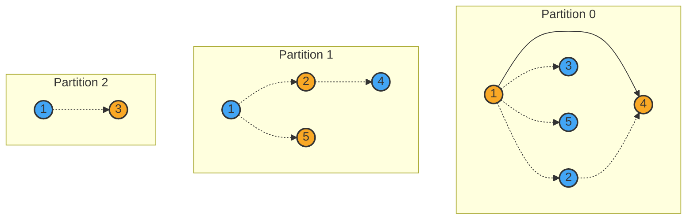
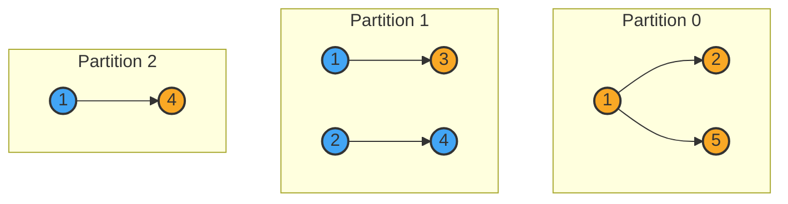
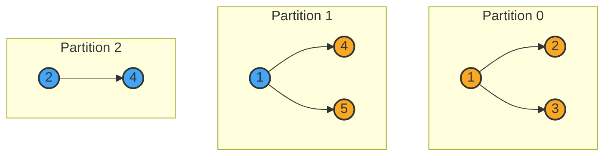
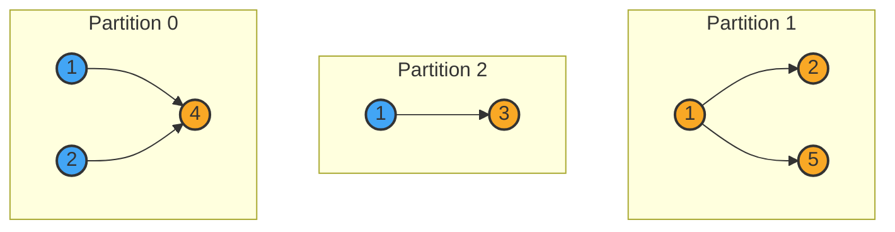

# HW8 Report
## 完成情况
* [x] 边切分算法
* [x] 随机顶点切分算法
* [x] 切分可视化
* [x] 大图处理
* [x] 启发式顶点切分算法
* [x] 混合顶点切分算法
## 文件结构
```
BIGDATASYSTEM_HW8
├── p_way_edge_cut.py
├── p_way_random_vertex_cut.py
├── p_way_heuristic_vertex_cut.py
├── p_way_hybrid_vertex_cut.py
├── utils.py
├── hw8_data
├── output
│   ├── edge_cut_output
│   ├── random_vertex_cut_output
│   ├── heuristic_vertex_cut_output
│   └── hybrid_vertex_cut_output
└── report.pdf
```
* `p_way_edge_cut.py`：边切分算法
* `p_way_random_vertex_cut.py`：随机顶点切分算法
* `p_way_heuristic_vertex_cut.py`：启发式顶点切分算法
* `p_way_hybrid_vertex_cut.py`：混合顶点切分算法
* `utils.py`：工具函数
* `hw8_data`：测试数据
* `output`：输出结果
* `report.pdf`：实验报告

## 运行环境
* Python 3.8.2

## 运行方式
```bash
python program.py   [-od --output_dir OUTPUT_DIR]
                    [-i --input_file INPUT_FILE]
                    [-n --num_partitions NUM_PARTITIONS]
                    [-t --degree_threshold THRESHOLD]
                    [-d --print_detail]
                    [-b --print_both]
                    [-m --draw_mermaid]
                    [-hu --huge_graph]
                    [-h --help]
```
其中，`program.py`为`p_way_edge_cut.py`、`p_way_random_vertex_cut.py`、`p_way_heuristic_vertex_cut.py`、`p_way_hybrid_vertex_cut.py`之一。
* `-od --output_dir`：输出文件夹，默认为`output`
* `-i --input_file`：输入文件，默认为`hw8_data/small-5.graph`
* `-n --num_partitions`：切分数，默认为`4`
* `-t --degree_threshold`：混合顶点切分算法的阈值，仅在`p_way_hybrid_vertex_cut.py`中需要设置使用，默认为`100`
* `-d --print_detail`：是否打印详细信息，默认为`False`
* `-b --print_both`：是否同时打印切分结果和详细信息，默认为`False`
* `-m --draw_mermaid`：是否绘制Mermaid图，默认为`False`
* `-hu --huge_graph`：是否处理大图，仅在输入文件为`twitter-2010.graph`时需要开启，且无法与`-m`、`-d`、`-b`同时使用
* `-h --help`：帮助信息

## 实现细节
### 输入与输出
在读取小文件时，可使用`open`函数直接读取文件，并通过`struct`模块解析二进制文件，将解析出的`src`与`dst`以元组形式存储到`edges`中；在读取大文件时，使用`mmap`模块将文件映射到内存中，在需要用到时再进行解析，以防止内存不足。
对于小文件，输出时可统计每个切分包含哪些边，可进行选择性存储，并据此绘制`mermaid`图；对于大文件，输出时只统计每个切分的边数；由于对大文件无法将所有边存储在内存中进行哈希去重，因此为保证前后一致性，对于重边只能将其重复计算在内。
输出的文件所在位置及命名为：
正常输出：`output/(algorithm)_output/(input_file)_(num_partitions)part.txt`
详细输出：`output/(algorithm)_output/(input_file)_(num_partitions)part_detailed.txt`
`mermaid`图：`output/(algorithm)_output/(input_file)_(num_partitions)part_mermaid.md`
其中，`algorithm`为`edge_cut`、`random_vertex_cut`、`heuristic_vertex_cut`、`hybrid_vertex_cut`之一，`input_file`为输入文件名（去除`.graph`后缀），`num_partitions`为切分数（2、3、4、8之一）。

### 边切分算法
首先统计所有不重复的顶点，并平均分配到每个切分中，作为`master_vertices`；然后遍历所有边，若边的两个顶点均在同一切分的`master_vertices`则将其加入该切分的`edges`，否则将其分别加入起点与终点所在切分的`replicated_edges`；最后更新起点与终点所在切分的`vertices`。

### 随机顶点切分算法
此处实现的是对边进行循环放置，即从切分`0`开始，每次随机选择一个切分，将边放入该切分中，直到所有边都被放置。对顶点，由于不需要实现基于哈希函数的顶点飞行主控，因此在顶点第一次出现时将其放入所在切分的`master_vertices`中，同时加入该切分的顶点集`vertices`；此后出现的顶点直接加入所在切分的`vertices`中。

### 启发式顶点切分算法
在随机顶点切分算法的基础上，添加对顶点所在切分的统计`vertex_to_machines`，记录每个顶点在哪些切分中出现过；在放置一条新边时，若存在若干切分同时包含边的两个顶点，则选择其中包含较少边的切分放置该边；若存在若干切分包含边的一个顶点，则同样选择其中包含较少边的切分放置该边；否则选取所有切分中包含边最少的切分放置该边。在选取完切分后，对其他变量的维护与随机顶点切分算法相同。
此外，启发式顶点切分算法很可能无法将边均匀分配到各个切分中，尤其是当所有顶点连通时，甚至可能将所有边都放入一个切分中。因此添加限定，首先计算出每个切分的平均边数，当某个切分的边数超过平均边数时，将其从候选切分中剔除，重新选择切分。

### 混合顶点切分算法
首先计算每个顶点的度数，并依据设定的阈值`degree_threshold`将顶点分为`high_degree_vertices`与`low_degree_vertices`；对于`high_degree_vertices`，将边放入源顶点经过哈希对应的切分中；对于`low_degree_vertices`，将边放入目标顶点经过哈希对应的切分中。为了保持与之前算法的一致性，同样不维护顶点的飞行主控，而是在顶点第一次出现时将其放入所在切分的`master_vertices`中。

## 实验结果
详细结果见`output`文件夹，在此仅就其中部分数据进行展示分析。
针对输出情况的具体分析如下：
#### edge_cut
对比文件夹下`roadNet-PA_2part.txt`、`roadNet-PA_3part.txt`、`roadNet-PA_4part.txt`、`roadNet-PA_8part.txt`四个文件，可以发现切分数增多时，总顶点、总复制边数明显增大，开销变大，性能在四种切分算法中最差。

#### random_vertex_cut
对比文件夹下`roadNet-PA_2part.txt`、`roadNet-PA_3part.txt`、`roadNet-PA_4part.txt`、`roadNet-PA_8part.txt`四个文件，可以发现切分数增多时，总顶点数同样也在变大，而由于切分方式，总边数不变。由于顶点是随机分配的，因此总顶点数与`edge_cut`相近。但经观察发现一个奇怪的现象，在`roadNet-PA`与`twitter-2010`上，`random_vertex_cut`所得到的复制点的总数明显多于`edge_cut`，而在`synthesized-1b`上则是少于，没有想明白为什么，或许与随机分配的方式有关。观察数据知，`synthesized-1b`的边为按照出发点由小到大的顺序生成的，而`roadNet-PA`是按照边的临近性生成的，`twitter-2010`的许多顶点都有通往自己序号$\pm 1$的边，因此可能是由于这种特殊性导致的。

#### heuristic_vertex_cut
对比文件夹下`roadNet-PA_2part.txt`、`roadNet-PA_3part.txt`、`roadNet-PA_4part.txt`、`roadNet-PA_8part.txt`四个文件，可以发现切分数增多时，总顶点数同样在变大，但不是很明显（例如在`roadNet-PA`上，`4part`与`8part`的总顶点数仅相差`20k`左右，仅占总数约`1220k`的`1.64%`）。同时，该方法在四种方法中，总复制边数最少。但由于其难以同时满足并行性与最优化，因此性能不如`hybrid_vertex_cut`。

#### hybrid_vertex_cut
观察发现其在`twitter-2010`上与`synthesized-1b`上的产生的总点数接近`heuristic_vertex_cut`，但在`roadNet-PA`上产生的复制点明显多于`heuristic_vertex_cut`而接近`edge_cut`。由于其在进行度数计算时可并行进行，而在边放置时基于哈希函数也可并行进行，因此综合性能较好。

### 在`small-5.graph`上的实验结果
#### edge_cut


#### random_vertex_cut


#### heuristic_vertex_cut


#### hybrid_vertex_cut
